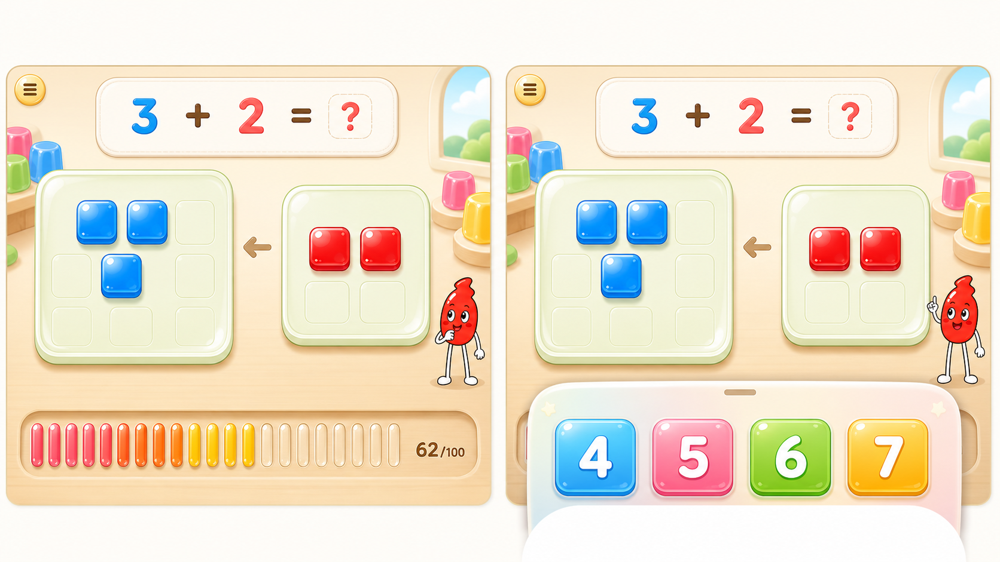

# Bottom Sheet Progress UI Implementation Plan

## Purpose

Implement the approved UI direction for the math game without compressing the jelly play area:

- The progress meter lives permanently in the bottom area currently used by the answer panel.
- The progress meter is visually embedded into the background/floor, not presented as a separate floating card.
- When answers become available, the answer panel appears as a real bottom-up sheet over the progress meter.
- The bottom sheet's lower edge is clipped by the viewport, so it feels like it has slid up from below.
- The sheet must stay low and must not climb into the plate/jelly play area.
- The existing red droplet mascot remains recognizable and important.
- Plate jellies remain glossy rounded-square objects, grid-aligned, and non-overlapping.

Reference concept image:



## Current Implementation Summary

Relevant files:

- `src/components/GameScreen.tsx`
  - Owns `successPhase`, `round.gameState`, answer visibility, progress value, and collection animation.
  - Currently renders `ProgressMeter` near the top of `.game-content`.
  - Renders answer choices inside `.answer-slot` only when `answerReady`.

- `src/components/ProgressMeter.tsx`
  - Currently renders 100 small square cells and a numeric label.
  - Exposes `value`, `target`, `collecting`, `completed`.

- `src/components/AnswerChoices.tsx`
  - Currently renders `.answer-area > .answer-grid > .answer-button`.
  - It can stay mostly intact, but its container should become the bottom sheet body.

- `src/styles/global.css`
  - Contains most layout and animation rules.
  - Current `.game-content` reserves `--answer-slot-height`.
  - Current `.answer-area` is a floating colorful panel, but not a true bottom sheet clipped by the viewport.
  - Current `.jelly-progress-meter` is absolutely positioned near the top-right.

- `src/components/JellyBoard.tsx`
  - Must remain mostly unchanged except for any spacing adjustments caused by the bottom row.
  - It already supports non-overlapping grid layout for square jellies.

## Target Layout

The game screen should have three stable vertical zones in landscape:

1. Question zone
   - Compact/featured equation panel remains at the top/upper-middle.
   - No progress meter in this zone.

2. Jelly play zone
   - Left plate, transfer arrow, right plate.
   - Preserve the current spacious feel.
   - Do not reduce plate height to make room for the progress meter.

3. Bottom HUD zone
   - Always reserved.
   - Contains the embedded progress meter in the background layer.
   - Contains the answer bottom sheet only when `answerReady`.
   - The sheet overlays the progress meter and is clipped at the screen bottom.

Recommended DOM shape in `GameScreen.tsx`:

```tsx
<div className="bottom-hud" aria-live="polite">
  <ProgressMeter ... variant="embedded" />
  <div className={`answer-sheet-slot ${answerReady ? "is-ready" : ""}`} aria-hidden={answerReady ? undefined : true}>
    {answerReady && <AnswerChoices ... />}
  </div>
</div>
```

This should replace the current pattern where `ProgressMeter` is rendered above `Equation`, and answer choices occupy `.answer-slot` independently.

## Progress Meter Design

Use a simple embedded groove with vertical jelly capsules:

- Not a card.
- Not a top HUD.
- Not a thin flat bar.
- Visually recessed into the bottom background.
- Low contrast enough to feel like background/floor, but still readable.
- Filled units are warm pink/red/yellow jelly capsules.
- Empty units are pale translucent capsules.
- A quiet `62/100` label is integrated into the groove.

Implementation recommendation:

- Keep `ProgressMeter` accessible as `role="meter"` with exact `aria-valuenow`, `aria-valuemin`, `aria-valuemax`, and `aria-valuetext`.
- Render visual capsules as a fixed count independent of the exact target if needed for mobile legibility.
- Suggested visual unit count: `50` capsules, each representing `2` collected jellies.
- Fill calculation:
  - `filledUnits = Math.floor((clampedValue / target) * visualUnitCount)`
  - Add a partial/current class if desired:
    - `is-current` on the first unfilled capsule when `clampedValue > 0 && clampedValue < target`.
- If exact 100-unit representation is required later, group every 10 with small spacing, but start with 50 for clarity.

Suggested component props:

```ts
type ProgressMeterProps = {
  value: number;
  target: number;
  collecting: boolean;
  completed: boolean;
  visualUnits?: number;
};
```

Suggested class structure:

```tsx
<section className="jelly-progress-meter is-embedded ..." role="meter" ...>
  <span className="progress-value">62/100</span>
  <div className="progress-capsule-track" aria-hidden="true">
    <span className="progress-capsule is-filled" />
    ...
  </div>
</section>
```

Do not make the capsules focusable or clickable.

## Answer Bottom Sheet Design

The answer panel should become a true bottom-up sheet:

- It occupies the same bottom zone as the progress meter.
- It is a floating UI layer above the embedded progress groove.
- Its lower edge extends beyond the viewport and is clipped by `.game-screen`.
- It has rounded top corners, a small centered handle/lip, and a clear soft shadow.
- It should not visually reach the plates.
- It should not cover the mascot's face or body.

CSS direction:

- `.bottom-hud`
  - `grid-area: answers`
  - `position: relative`
  - `min-height: var(--bottom-hud-height)`
  - `overflow: visible`
  - `align-self: end`

- `.jelly-progress-meter.is-embedded`
  - `position: absolute`
  - `left/right/bottom`
  - `z-index: 1`
  - recessed background style
  - no strong drop shadow

- `.answer-sheet-slot`
  - `position: absolute`
  - `left: 50%`
  - `bottom: calc(-1 * var(--answer-sheet-clip))`
  - `transform: translateX(-50%) translateY(100%)`
  - `z-index: 4`
  - `pointer-events: none`

- `.answer-sheet-slot.is-ready`
  - `transform: translateX(-50%) translateY(0)`
  - `pointer-events: auto`
  - animation: bottom sheet slide up

- `.answer-area`
  - becomes the visible sheet surface.
  - width similar to current answer panel.
  - rounded top corners are more important than bottom corners because bottom is clipped.
  - add `::before` for the sheet handle.

Important height rule:

- The top of the sheet should stay within the bottom 22-28% of the viewport in landscape.
- On short landscape screens, reduce button height/padding before allowing the sheet to rise.
- Do not increase `--answer-slot-height` in a way that shrinks `.jelly-board`.

## Character Placement

The existing red droplet character must remain:

- `src/components/Character.tsx` already maps states to generated sprites.
- The visual requirement is the red droplet character from the screenshot, not the green placeholder used in earlier mockups.
- Before implementing layout, inspect current sprite files and current rendered state.
- Keep `.game-character` outside `.game-content` as an absolute layer, as it is today.

Target placement:

- Normal state:
  - Bottom-right, near the lower safe area, but not inside the answer sheet.
- Answer state:
  - Slightly above or beside the sheet.
  - Must not overlap buttons.
  - Must not overlap plate jellies.
- Success reading/collection:
  - Existing enlarged character behavior can remain, but may need new bottom offsets so it does not collide with the sheet or skip button.

CSS to review:

- `.game-character`
- `.game-character.is-large`
- landscape media rules around line `@media (max-width: 900px) and (orientation: landscape)`
- `.success-skip-button`

## Collection Animation

Current behavior:

- `successPhase === "collecting"` renders `.collection-flyers`.
- Flyers animate toward the old top-right meter.

Required change:

- Flyers should travel toward the bottom embedded progress groove.
- Since the meter is no longer at top-right, update `collection-fly-to-meter` keyframes.
- Direction should be downward and slightly toward the active progress area.
- The movement should terminate near the bottom groove or behind the answer-sheet layer.

Recommended approach:

1. Make `.collection-flyers` still absolute over `.game-content`.
2. Start flyers near center/plate area.
3. End flyers around:
   - `translate3d(0, calc(42vh), 0)` for desktop-ish landscape, or
   - use CSS variables set on `.bottom-hud` if more precision is needed.
4. During answer/collection phases, ensure the answer sheet is not visible unless intentionally part of the success flow.

Note:

- If collecting happens after correct answer and before the success overlay, the bottom sheet may still be visible from the correct state. Decide whether it should remain visible, fade down, or be covered by the success reading state.
- Preferred first implementation: keep the correct answer sheet visible during `successPhase === "reading"`, then fade/disable during `collecting` so the flyers visibly enter the embedded progress groove.

## State And Render Logic

Current key booleans in `GameScreen.tsx`:

- `answerReady`
- `answerDisabled`
- `successReading`
- `collecting`
- `characterLarge`
- `displayedMeterValue`

Implementation adjustments:

1. Move `ProgressMeter` into the bottom HUD.
2. Keep it always rendered on the game screen, including presenting/manipulating/answering/correct.
3. Render `AnswerChoices` only when `answerReady`, but inside the bottom sheet slot.
4. Add a CSS state for when collecting is active:
   - `.bottom-hud.is-collecting`
   - `.answer-sheet-slot.is-dimmed` or hide sheet if needed.
5. Preserve `aria-hidden` behavior:
   - The bottom sheet should be `aria-hidden` when no answers are visible.
   - The meter remains accessible as meter.

Potential class:

```tsx
const bottomHudClassName = `bottom-hud${answerReady ? " has-answer-sheet" : ""}${collecting ? " is-collecting" : ""}`;
```

## CSS Refactor Plan

Primary CSS edits in `src/styles/global.css`:

1. Remove or neutralize old top-right meter placement:
   - `.jelly-progress-meter { position: absolute; top/right; width: ... }`
   - replace with embedded bottom style.

2. Introduce bottom HUD tokens:

```css
.game-content {
  --bottom-hud-height: 132px;
  --answer-sheet-clip: 22px;
}
```

For landscape:

```css
@media (max-width: 900px) and (orientation: landscape) {
  .game-content {
    --bottom-hud-height: 76px;
    --answer-sheet-clip: 14px;
  }
}
```

3. Replace `.answer-slot` rules with `.bottom-hud` and `.answer-sheet-slot`.

4. Convert `.answer-area` into a sheet:
   - top rounded corners
   - subtle handle
   - shadow
   - bottom clipped by viewport through negative bottom offset

5. Keep answer button dimensions stable:
   - Current landscape `min-height: 54px` is likely good.
   - Check 4 buttons fit without rising too high.

6. Add embedded progress groove/capsule styles:
   - `.jelly-progress-meter.is-embedded`
   - `.progress-capsule-track`
   - `.progress-capsule`
   - `.progress-capsule.is-filled`
   - `.progress-capsule.is-current`

7. Update reduced motion:
   - Bottom sheet should appear instantly or with minimal fade when `prefers-reduced-motion`.
   - Capsule wave/collecting animation should be disabled or one-shot.

## Component-Level Steps

### Step 1: ProgressMeter component

- Replace square-cell visual with vertical capsule visual.
- Add optional `visualUnits`.
- Keep exact ARIA values.
- Keep `collecting` and `completed` classes.
- Avoid any touch/click affordance.

### Step 2: GameScreen layout

- Move `ProgressMeter` from top of `.game-content` into bottom HUD.
- Replace `.answer-slot` with `.bottom-hud` and `.answer-sheet-slot`.
- Keep `AnswerChoices` rendering condition and handlers unchanged.
- Ensure `displayedMeterValue` still uses animated `meterValue` during collection.

### Step 3: AnswerChoices styles

- The TSX can probably remain unchanged.
- CSS should make `.answer-area` act as the sheet surface.
- Add handle via CSS pseudo-element rather than markup if possible.

### Step 4: Collection flyer animation

- Update destination from top-right to bottom groove.
- Validate with normal and reduced motion.

### Step 5: Character offsets

- Adjust `.game-character` and `.game-character.is-large` for:
  - default landscape
  - low-height landscape
  - answer sheet visible
  - success reading/skip button visible

If CSS needs state-aware placement, add a class on `.game-screen` or `.game-content`, e.g.:

```tsx
<section className={`screen game-screen${answerReady ? " has-answer-sheet" : ""}`}>
```

Use this only if static offsets are insufficient.

## Acceptance Criteria

Functional:

- Progress meter is visible before answer choices appear.
- Answer choices slide in as a bottom sheet from below.
- Bottom sheet lower edge is clipped by the screen bottom.
- Bottom sheet does not enter or cover the plate/jelly area.
- Progress value updates after correct answers as before.
- 100-jelly true clear behavior remains unchanged.
- Reload after completion still prevents re-answering the final problem.

Visual:

- Progress meter feels embedded in the background/floor, not like a button or card.
- Progress uses simple vertical jelly capsules.
- Main plate jellies remain rounded-square, non-overlapping, and grid-aligned.
- Existing red droplet mascot remains recognizable and not replaced.
- Answer panel feels like a floating UI layer above the embedded progress row.
- Problem panel and answer buttons retain the current pleasant feel.

Accessibility:

- `ProgressMeter` remains `role="meter"` with exact current/target values.
- Answer buttons remain keyboard/touch accessible.
- Hidden answer sheet is not exposed to screen readers before `answerReady`.
- Assist OFF behavior for plate counts remains unchanged.
- Reduced motion is respected.

Responsive:

- Target landscape mobile layout works at:
  - `844 x 390`
  - `852 x 393`
  - `932 x 430`
  - `667 x 375`
- Desktop preview still looks reasonable at:
  - `960 x 540`
  - `1280 x 720`
- Portrait orientation prompt remains unchanged.

## Verification Plan

Run:

```bash
npm run lint
npm run build
```

Manual checks in browser:

1. New session, addition mode, assist ON.
2. Presenting state:
   - bottom embedded progress visible.
   - no answer sheet.
3. Manipulating state:
   - plates retain room.
   - progress remains unobtrusive.
4. Answering state:
   - bottom sheet appears low.
   - sheet bottom is clipped by viewport.
   - buttons do not overlap mascot or plates.
5. Correct answer:
   - reading animation still works.
   - collection animation goes toward bottom progress groove.
   - meter increments correctly.
6. Assist OFF:
   - plate count labels and ARIA count hints remain hidden.
7. Subtraction mode:
   - red move jellies on left plate still work.
   - bottom sheet behavior is identical.
8. 100 completion:
   - true clear overlay still appears.
   - reload completed state and ensure final problem cannot be re-answered.

Recommended automated/visual checks:

- Use Playwright or browser screenshots for the listed viewport sizes.
- Capture states:
  - presenting
  - manipulating
  - answering
  - correct/success reading
  - collecting
  - overlay
- Compare that `.source-group` plate bounds do not intersect `.answer-area` bounds.

## Risks And Mitigations

- Risk: bottom sheet steals too much height on short landscape screens.
  - Mitigation: reduce sheet padding/button height in the landscape media query; do not increase grid row height.

- Risk: embedded progress meter looks like a tappable control.
  - Mitigation: remove button-like shadows, keep it recessed, disable pointer cursor, no hover/active styles.

- Risk: progress capsules become visually noisy.
  - Mitigation: start with 50 visual units and exact numeric label; group with subtle spacing every 10.

- Risk: mascot overlaps sheet/buttons.
  - Mitigation: add `has-answer-sheet` class and lower/right-aware offsets if static placement fails.

- Risk: collection animation still flies to old top-right position.
  - Mitigation: update `collection-fly-to-meter` keyframes and verify visually.

- Risk: success overlay scroll/low-height behavior regresses.
  - Mitigation: keep `.success-panel` scroll rules unchanged and test low-height landscape.

## Suggested Implementation Order For Next Session

1. Review this plan and latest reference image.
2. Inspect current `GameScreen.tsx`, `ProgressMeter.tsx`, `AnswerChoices.tsx`, and `global.css`.
3. Patch `ProgressMeter` visual structure first.
4. Patch `GameScreen` layout to move meter into bottom HUD.
5. Patch CSS for bottom HUD, embedded groove, and answer bottom sheet.
6. Patch collection flyer destination.
7. Adjust character placement.
8. Run lint/build.
9. Run visual checks and iterate only on layout issues.

## Non-Goals

- Do not redesign problem generation.
- Do not change answer choice logic.
- Do not replace the existing mascot.
- Do not change the plate jelly object shape.
- Do not add new audio behavior.
- Do not redesign success overlay beyond avoiding layout collisions.
